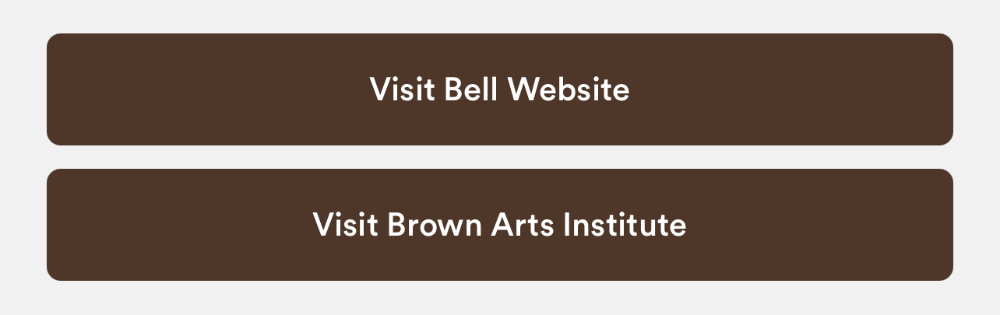

### General Styles

* 48px high
* 6px rounded corners
* Font is white, circular, 14pt
* Padding: at least 20px
* Background
  * Light mode
    * Background of “primary” buttons are official Brown Brown (#4e3629) with white text and icon
    * Secondary buttons are brown outline and text with white fill
  * Dark mode
    * Primary and secondary buttons both the same - Brown Taupe background #B7B09C with black text
* If buttons are floating over the bottom of the screen (for example, on card balances, today@brown) they should have a block of background color behind them (so when you are scrolling you don’t see the page contents behind them)
* Disabled buttons should be at 50% opacity if disabled (the text should remain at full opacity) This doesn't need to pass accessibility - according to WCAG "Text or images of text that are part of an inactive user interface component."
* Icons
  * Icons size padding (TBD)
  * Buttons have an icon if linked to external activity
    * Opening the phone map
      * Opening an external link
      * Opening another app
      * Downloading content to phone
* Types of Buttons
  * Internal link
  * External link
  * Log in
  * Form buttons (includes search)
  * Primary vs secondary buttons
  * Icon buttons
    * Bookmark (future)

    

    
