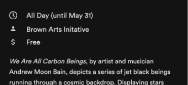

## Component `Icon`

### Props
* icon - string - required
* size - number - required
* theme - required
* iconStyle - object of ImageStyle & { color: string } - optional
* onPress - function - optional
* role - string - optional
* accessibilityLabel - string - optional
* disabled - boolean - optional

## Text with Icons

Text with icons can be added to text areas to denote characteristics (for example, time or cost).
* Text 14pt circular generalText
* Icons are 15px largest dimension



## Commonly Used Icons

- about: "about-solid"
- search: "search-solid"
- bookmarks & bookmarked item: "bookmark-solid"
- not bookmarked item: "bookmark"
- link to outside app: "external-link-alt"
- move to screen: "chevron-right"
- accordion opened: "chevron-up"
- accordion closed: "chevron-down"
- Location: “location-pin”
- Phone number: “phone-solid”
- Email contact: “email”
- Hours: “clock 2”

## Creating Custom Icons for the App with a Typeface

### Prerequisites:
  * Files will need to be SVGs to be converted
  * SVGs will need to be of a solid color, no shadows or such.
    * in the case of the OUC sketch files for icons, most will not work and will need to be exported as PNG files and then converted
  * to convert a PNG file to SVG you can use this node app [https://github.com/adam-at-brown/png_to_svg_converter](https://github.com/adam-at-brown/png_to_svg_converter)

### Convert SVG to Typeface (font):
  * Add any newly created SVG files to the **./svgs_for_icons** directory
  * Go to [https://icomoon.io/app/#/select](https://icomoon.io/app/#/select)
  * Click **Import Icons** button in top nav bar
  * In the uploader dialogue box, navigate to the **./svgs_for_icons** directory
  * select all of the files then click the **Choose for Upload** button
  * In the newly created set, click the hamburger icon in the upper right hand corner then choose **Select All**
  * Click **Generate Font F** in the bottom footer/nav
  * Preview the fonts/icons to see if there are any issues, they will be named as the file name by default
  * Click **Font Download** in the bottom footer/nav
  * Unzip the dowloaded file

### Update Custom Font in App:
  * in the **./fonts** directory of the project, replace the **icomoon.ttf** file with the new one located in the downloaded **icomoon/fonts** folder
  * in the **src/shared/custom_icons/** replace **selection.json** file with the new one located in the downloaded **icomoon** folder

### Add new Icon to Component
  * go to **src/shared/components/icon/components.tsx**
  * anywhere in the **iconComponents** object, add a new line where the key is the file name of the new icon and the value is **IcoMoon**
    * IE ```{ "healthy_notxt": IcoMoon }```
