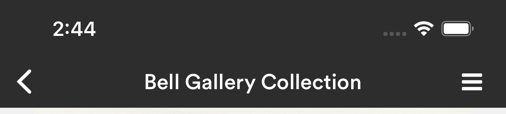

Screens with this element: all

* Height of header is 48 px below the area used by phone
* Font 18pt, Circular
* Light and Dark mode colors are the same
* Background `theme.COLORS.headerBackground`
* Text  `theme.COLORS.headerText`
* Arrow for back navigation except on home screen
