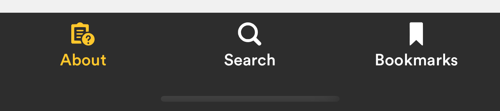

The bottom navigation can be used to link to in-app content related to the current module

* Height 60px
* Colors same for light/dark mode
  * Background: `theme.COLORS.headerBackground`
  * Selected icon / text color: `theme.COLORS.headerText`
  * Selected background color: `theme.COLORS.gold`
  * Divider: `theme.COLORS.divider`
