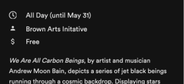

## Text with Icons

Text with icons can be added to text areas to denote characteristics (for example, time or cost).
* Text 14pt circular generalText
* Icons are 15px largest dimension

## Commonly Used Icons

- about: "about-solid"
- search: "search-solid"
- bookmarks & bookmarked item: "bookmark-solid"
- not bookmarked item: "bookmark"
- link to outside app: "external-link-alt"
- move to screen: "chevron-right"
- accordion opened: "chevron-up"
- accordion closed: "chevron-down"
- Location: “location-pin”
- Phone number: “phone-solid”
- Email contact: “email”
- Hours: “clock 2”
